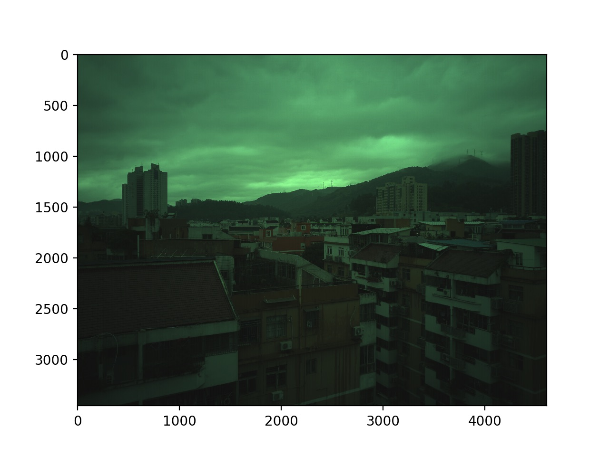

# raweye
### What it is ?
> a tool to show raw10,raw16 image or convert it to jpeg/png.



### Installation
**Installation with pip**
```bash
pip install raweye
```

**Installtion from source**
```bash
$ git clone https://github.com/TUSSON/raweye.git
$ python setup.py install
```

### Usage
**show raw**
```bash
$ raweye.py test/4608_3456.raw -H 3456
```

**convert raw to jpeg/png**
```bash
$ raweye.py test/4608_3456.raw -H 3456 -o test.jpeg
```

### Help
```bash
$ raweye.py -h
usage: raweye.py [-h] -H HEIGHT [-W WIDTH] [-s OFFSET]
                 [-t {raw10,raw16,raw,gray,yuv,yvu}]
                 [-b {rggb,bggr,grbg,gbrg}] [-d DGAIN] [-o FILE]
                 InputRawFile

Show raw image or convert it to jpeg/png.

positional arguments:
    InputRawFile          source raw image

optional arguments:
    -h, --help            show this help message and exit
    -H HEIGHT
    -W WIDTH
    -s OFFSET
    -t {raw10,raw16,raw,gray,yuv,yvu}
                          raw10 : continue 10bits
                          raw   : mipi 10bits
                          raw16 : 16bits
                          gray  : y 8bits
                          yuv   : yuv420 8bits
                          yvu   : yvu420 8bits
    -b {rggb,bggr,grbg,gbrg}
    -d DGAIN              digit gain apply
    -o FILE               write image to FILE
```
